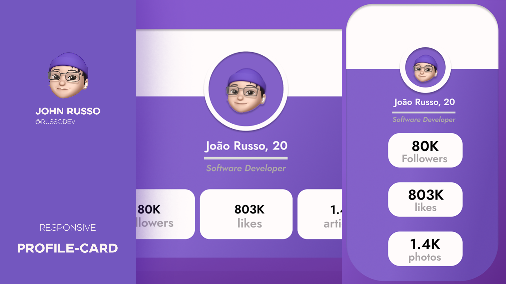

<h1 align="center"> Responsive Profile Card</h1>

A profile card completely responsive for mobile and desktop displays.

  <a href="#-tecnologias">Tecnologies</a>&nbsp;&nbsp;&nbsp;|&nbsp;&nbsp;&nbsp;
  <a href="#-projeto">Project</a>&nbsp;&nbsp;&nbsp;|&nbsp;&nbsp;&nbsp;
  <a href="#-layout">Layout</a>&nbsp;&nbsp;&nbsp;|&nbsp;&nbsp;&nbsp;
  <a href="#memo-licença">License</a>

 

   

---
## 💻 Project

This project was conceived with the objective of bring a layout which is dynamic and I have chosen a minimalistic approach for the design being simple and assertive. 

---

## 🚀 Tecnologies

This project was developed with:

- Figma - prototyping

- HTML e CSS -structure and styling

- Git & GitHub - for deploying

---

## 🔖 Layout

You can view the project layout through [DESSE LINK](https://www.figma.com/community/file/1181416183170506716). You must have an account at [Figma](https://figma.com) for access.

---
